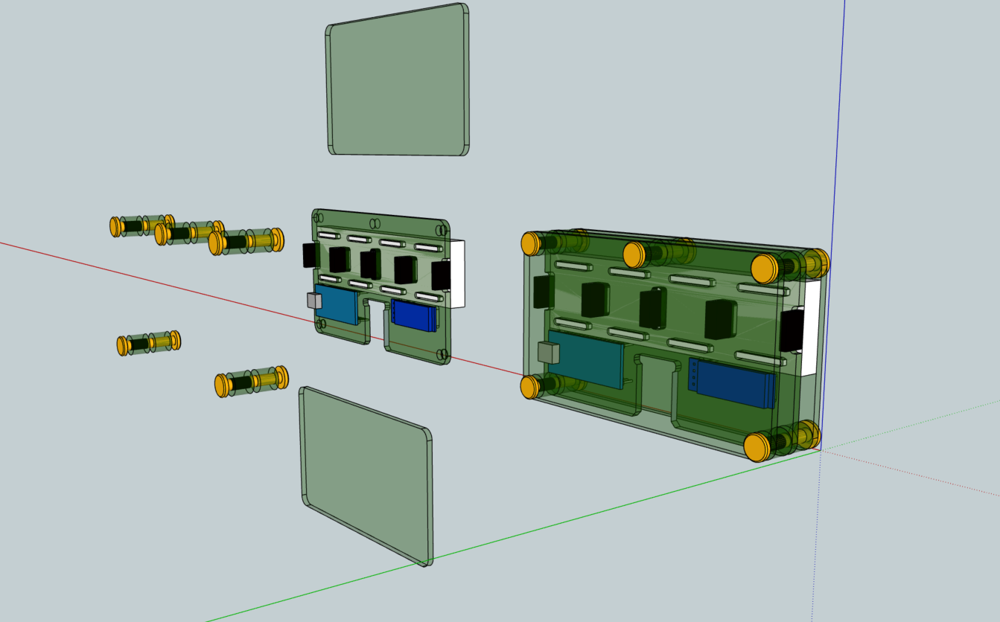
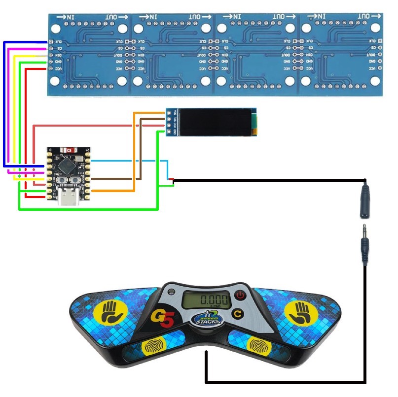

# display-latam
ESP32-based project to make a display for speedcubing timers.

We seek to create an alternative to commercially available displays which is cheaper, lighter,open-source, repairable, and sustainable.

## How to contribute

Take a look at the open issues on the repository to see how you can contribute. Open an issue for a request or suggestion. You can also send an email for contato@abracm.org.br for enquries, contributions, feedback, etc.

The language of the project is English to make it more accesible worldwide.

Please stick to the following best practices when contributing to this project:
- Open a new branch and a pull request (PR) whenever you want to change the code or documentation
- Make sure to provide enough details about the changes in your PR so other contributors can easily understand them  
- Always wait for at least one approving review before merging the PR

Currently, the code is functional, but the documentation needs work, which makes it hard for communities to build their own version. The work plan is on the short medium term is:
1. gather ideas and contributions for an Alpha release
2. incorporate pull requests, contributions which are a short term priority
3. prepare documentation, tutorials for the release of the Alpha version 
4. release the Alpha version, make easily available for communities to build and test out - can we do it by the end of August/start of September?
5. work on improvements to the Alpha version, receive feedback from users
6. create hardware specifications for a 1.0 version release (make hardware investments future proof)
7. release 1.0 version of project, make sure future code updates are backwards compatible with the hardware

## Features

TODO 
add video demo

## Libraries setup
From Libs.zip, extrac Libs folder and copy it's contents to your Arduino/Libraries directory.

## Software Installation guide
Software Installation guide:

1. Install the Arduino IDE software from https://www.arduino.cc/en/software 
2. It should create a folder named “Arduino” in Documents, you want to create 2 folders, “display-latam”, and “Libraries”.
3. Download the Libs.zip file from the GitHub, extract the zip file, and then place all of the folders in the zip file to the “Libraries” folder.

4. Place the “display-latam.ino”, “xantofont.cpp”, and “xantofont.h” files in the “display_latam folder.

5. Click on the display-latam.ino file to open it up in Arduino IDE. 
6. Connect your board to your computer with USB, the official Arduino website has more detailed instructions on this. I actually had a lot of trouble with this initially, my solution was to just try every USB port until one worked. https://support.arduino.cc/hc/en-us/articles/4406856349970-Select-board-and-port-in-Arduino-IDE 
7. Press the upload button and wait for it to upload. You also need to use a USB cable that is capable of transmitting data (some USB cables have power only) or it will not be able to upload. 

8. It should finish uploading successfully and the console should look like this when it is finished. The display should be ready for usage now.

## installation, how to build

TODO 

Draft preview of the project (using the acrylic covers)

Schematics for the ESP32 C3 mini are as follows:

Schematics for the ESP32 S2 are also available at `doc/schematics_esp32_s2.jpg`
### Parts list

- ESP32 C3 mini (you might be able to use other ESP32s or Arduinos with code changes, testing needed)
- 4 in 1 MAX7219 LED display matrix
- 0.91” OLED display
- 3.5mm female jack to bare wire with 2 pole
- 3.5mm to 2.5mm data cable (to connect to the timer)
- wires and solder

Two alternatives for encasing the hardware: 

| Materials/type | Details |
| --- | --- |
| <ul><li>3mm polycarbonate sheet</li><li>Chicago screws that are 25mm long and 5mm in diameter</li><li>Spacers of 5mm in diameter with a length according to the LED matrix you have. If the display has sockets, you need spacers four 7mm long spacers and four 10mm long ones. If the display is soldered, you need eight spacers with a length of 8.5mm.</li><li>tint for contrast</li></ul> | cutout for CNC available on `doc/acrylic-cover.skp`, see `doc/prototype_demo.skp` for demo on how to build |
| 3D printed case | draft design available on `doc/draft_case.stl` (WIP) |

For power, you could use:
- Standard USBC 5v chargers plugged to a power source
- Power banks, e.g. made using 18650 batteries and a battery case (this is usually cheaper than buying a commercial power bank)

For the display stand, you could use the 3D-printed stand available on `doc/stand.stl`.

Current estimates for the cost of the materials for a display are of around USD ~20 (buying supplies off China e.g. Aliexpress).

## Contributors

We are specially greatful to Fabio Seiji Massui [2013MASS01](https://www.worldcubeassociation.org/persons/2013MASS01) for kicking off this project and inspiring us to pursue the goal of developing an open-source and cheap alternative to commercial displays.

Other contributors include:
- jayanth-rajakumar: Original [ledmat](https://github.com/jayanth-rajakumar/ledmat) project
- Cady Shields: 3D-printed display stand design
- Alex Maass: 3D-printed case design

## Speedstacks timer signal protocol

The Speedstacks timers send a digital audio signal thorugh the data port ([example](https://imgur.com/mRPrlxn)). This is a guide how on to interpret the signal.

The timer sends the signal with a fixed rate of 1200 bits per second (check if this is correct and consistent across all timer generations). It sends a packet that are 90 or 100 bytes long to convey a single time to be displayed.

### Idle values

The bitstream user a standard idle value (0 or 1) to inform when a byte or a packet ended. The idle value varies across timer generations (see section below on timer generations).

Each byte is proceeded by a non-idle value, to show that the byte has begun, and followed by an idle value, to show that it has ended.

*example of a Gen 3 timer bitstream- the idle value is 1*

*example of a Gen 4 timer bitstream- the idle value is 0*

Each packet is separated by an unspecificed number of idle values (check if we can tell an exact amount and if it is consistent across timers). Therefore, to check if a packet has ended, you just need to check if you can read ten or more equal values in a row, as that couldn't happen if a byte was being transmitted.

### Packets

A time to be displayed is sent as a packet that can be 9 or 10 bytes long. The lenght of the packet is determined by the timer generation (see section below on timer generations).

Because of the non-idle value and idle value that go before and after each byte, the bytes take 10 bits to be transmitted, and the packet lenghts are therefore 90 or 100 bits.

Here is an example of a full packet extracted from a Gen 3 timer that will use to break down what each byte means. **TODO**

Notice that this packet it 10 bytes long and uses 1 as its idle value.

These are what each byte consists of:

#### byte 1: state of the timer

The first byte is an ASCII code for one of the following letters, which represent the state the timer is in:

- "L" (Left hand on timer)
- "R" (Right hand on timer)
- "C" (Both hands on timer)
- "A" (Ready to start)
- "I" (Reset)
- "S" (Stopped)
- " " (Running and no hands on sensor)

#### byte 2-6 or 2-7: time itself

These are the bytes that convey the time information. Byte 7 may or may not be a part of this depending on the timer generation (see section below on timer generations).

Here is the breakdown on byte-by-byte:
- 2: minutes
- 3: tens of seconds
- 4: units of seconds
- 5: tenths of a second
- 6: hundreths of a second
- 7 (if in use): thousands of a second (check - if 7th byte no used to convey time information, does timer simply not transmit thousands of a second?)

The byte represents the ASCII code for the digit, which is the digit + 48

#### 3rd to last byte: checksum

This byte is a checksum of the previous bytes (2-6 or 2-7), to ensure the reading is correct.

It it the sum of the values (not the ASCII codes) of all digits + 64.

#### 2nd to last and last bytes: unnecessary line breaks?

These bytes are the ASCII codes for \n (newline) and \r (carriage return). Is this just useless?

### Processing a byte

After reading the 10 bits necessary for a byte (non-idle value + byte + idle value), you must first discard the 1st and the last bits of the byte.

Then, you must place the bits in reverse order. E.g. (11001001 becomes 10010011)

Finally, the bits must be inverted to arrive at the final byte (10010011 becomes 01101100). *do timers with a 0 idle value also need to be inverted?*

### Example of interpreting a packet from start to finish

WIP

### Speedstacks timer generations

#### Generation 3

- Packet length: 10 bytes
- Idle value: 1

#### Generation 4

- Packet length: 9 bytes (dobule check)
- Idle value: 0 (double check)

#### Generation 5

- Packet length: need to check
- Idle value: 1 (double check)

*can we easily support other non-speedstacks timers? testing needed*

### Useful sources

- Odder's Stacktimer Signal Processor [link](https://github.com/Kubiverse/StackmatSignalProcessor): reference on how to process the stackmat signal bitstream (for Gen 4 timers)
- JFly's [explanation](https://www.jflei.com/2014/08/21/dialup-stackmat/) on the speedstacks timer signal and reading it in a phone
- freundTech's [explanation](https://old.reddit.com/r/Cubers/comments/64czya/wip_stackmat_timer_support_for_twistytimer_app/dg19s4y/) on what the speedstacks timer signal bitstream is composed of
- Dan Smith [testing](https://youtu.be/1QEm99bT8WQ?si=v6V7CJI6A0WZBTTA) what causes reset issues in Gen 5 timers
- Coding [experiments](https://forum.arduino.cc/t/display-for-stackmat-timer/946502) on forum
- [Wiring](https://lastminuteengineers.com/max7219-dot-matrix-arduino-tutorial/) a MAX7219 LED Dot Matrix
- Getting [started](https://www.circuitgeeks.com/arduino-max7219-led-matrix-display/) with MD Parola
- Old stackmat display [project](https://web.archive.org/web/20100820185842/http://hackvalue.de:80/hv_atmel_stackmat)

#### Migrating an Arduino board to a standalone microcontroller on a breadboard

- https://docs.arduino.cc/built-in-examples/arduino-isp/ArduinoToBreadboard
- https://www.martyncurrey.com/arduino-atmega-328p-fuse-settings/
- https://www.instructables.com/Configure-Arduino-IDE-for-Atmega-328P-to-Use-8MHz-/
- https://www.instructables.com/USBASP-Bootloading-a-ATMega328p-with-a-8mhZ-intern/
